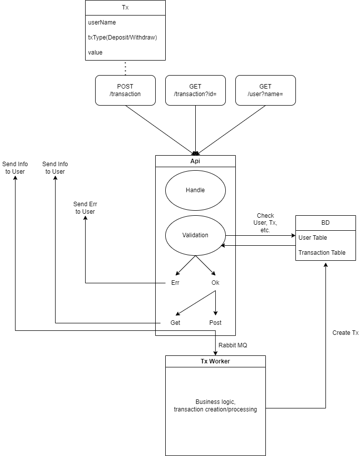

# Payment Project

**A small service MVP, which allows the user to deposit(tx_type="deposit"), withdraw funds(tx_type="withdraw"), get information about transactions by `transaction id` and the current balance of the user by `user id`.**

### Run in Docker compose

```
# docker-compose up
```

### Workflow

#### Step 1 - Registration User and Deposit

POST : `/v1.0/payment`

BODY : `{
"user_id":string,
"amount":number,
"tx_type":string
}`

EXAMPLE REQUEST:  

`http://localhost:8088/v1.0/payment`

`{
"user_id":"Ilyha",
"amount":100,
"tx_type":"deposit"
}`

EXAMPLE RESPONSE:

`{"payment_id":"f3df665d-7378-449f-88fc-f5dfa443951e"}`  


#### Step 2 - Get User

GET : `/v1.0/user?id=user_id`

EXAMPLE REQUEST:  

`http://localhost:8088/v1.0/user?id=Ilyha`

EXAMPLE RESPONSE:

`{"ID":"Ilyha","Balance":100}`  


#### Step 3 - Get Transaction Info by id

GET : `/v1.0/payment?id=tx_id`

EXAMPLE REQUEST:

`http://localhost:8088/v1.0/payment?id=f3df665d-7378-449f-88fc-f5dfa443951e`

EXAMPLE RESPONSE:

`{"ID":"f3df665d-7378-449f-88fc-f5dfa443951e","UserID":"Ilyha","Amount":100,"TxType":"deposit"}`  


#### Step 4 - Withdraw

POST : `/v1.0/payment`

BODY : `{
"user_id":string,
"amount":number,
"tx_type":string
}`

EXAMPLE REQUEST:

`http://localhost:8088/v1.0/payment`

`{
"user_id":"Ilyha",
"amount":50,
"tx_type":"withdraw"
}`

EXAMPLE RESPONSE:

`{"payment_id":"2126c627-294a-47b0-bb96-7e383615859d"}`

### Pjoject Architecture Visualisation


